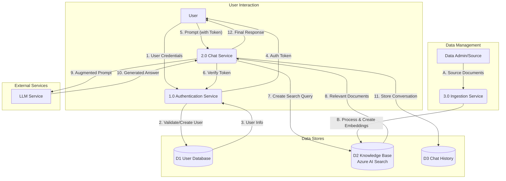

# DFD (Data Flow Diagram) - Level 0

Diagram ini menggambarkan alur data utama pada aplikasi chatbot.

- **Persegi Panjang**: Entitas Eksternal (sumber atau tujuan data).
- **Lingkaran/Oval**: Proses yang mentransformasi data.
- **Garis Terbuka**: Penyimpanan Data (Data Store).

> **Penjelasan Alur:**
> 1.  **Authentication**: Pengguna mengirim kredensial ke *Authentication Service*, yang memvalidasinya dengan *User Database* dan mengembalikan token.
> 2.  **Ingestion**: Admin menyediakan dokumen ke *Ingestion Service*, yang memprosesnya dan menyimpannya ke dalam *Knowledge Base* (Azure AI Search).
> 3.  **Chat**: Pengguna mengirim prompt (beserta token) ke *Chat Service*. Layanan ini mengambil dokumen relevan dari *Knowledge Base*, mengirimkannya bersama prompt ke *LLM Service*, menerima jawaban, menyimpan histori, dan mengirimkan respons akhir ke pengguna.
