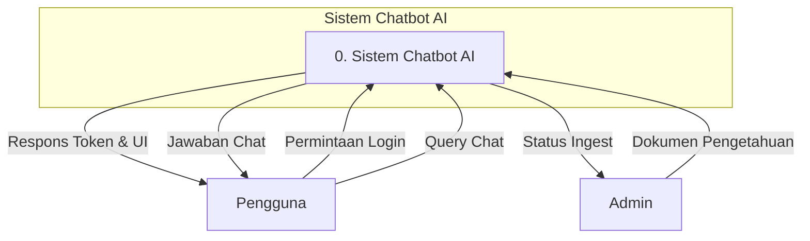
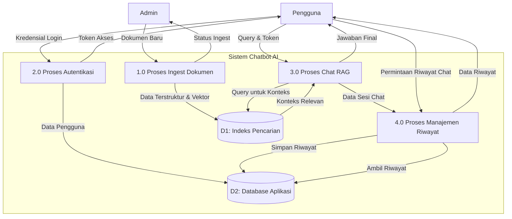

# Data Flow Diagram (DFD) Sistem Chatbot AI

Dokumen ini merincikan Data Flow Diagram (DFD) untuk sistem Chatbot AI. DFD digunakan untuk memodelkan alur data melalui sistem, menggambarkan bagaimana data diproses dan disimpan oleh berbagai komponen sistem.

## Entitas Eksternal dan Penyimpanan Data

- **Entitas Eksternal:**
  - **Pengguna (User):** Individu yang berinteraksi dengan chatbot untuk mendapatkan informasi.
  - **Admin:** Pengguna dengan hak akses khusus untuk mengelola sumber data pengetahuan (knowledge base).
- **Penyimpanan Data (Data Store):**
  - **D1 - Indeks Pencarian (Azure AI Search):** Menyimpan data dan vektor dari dokumen yang telah diproses untuk pencarian cepat (retrieval).
  - **D2 - Database Aplikasi (Azure Cosmos DB/PostgreSQL):** Menyimpan data pengguna, riwayat chat, dan informasi terkait aplikasi lainnya.

---

## Level 0: Diagram Konteks

Diagram Konteks memberikan gambaran umum tingkat tinggi dari keseluruhan sistem. Ini menunjukkan entitas eksternal utama yang berinteraksi dengan sistem dan aliran data dasar antara mereka dan sistem.



**Penjelasan Alur Data Level 0:**
- **Permintaan Login:** Pengguna mengirimkan kredensial untuk otentikasi.
- **Respons Token & UI:** Sistem memberikan token akses dan antarmuka pengguna setelah login berhasil.
- **Query Chat:** Pengguna mengirimkan pertanyaan ke sistem.
- **Jawaban Chat:** Sistem memberikan jawaban yang relevan berdasarkan pemrosesan internal.
- **Dokumen Pengetahuan:** Admin mengunggah atau menyediakan dokumen sebagai basis pengetahuan untuk chatbot.
- **Status Ingest:** Sistem memberikan umpan balik kepada Admin mengenai status proses ingest dokumen.

---

## Level 1: DFD Sistem

DFD Level 1 memecah proses utama "Sistem Chatbot AI" menjadi sub-proses yang lebih detail, menunjukkan bagaimana data mengalir di antara proses-proses ini dan penyimpanan data internal.



**Penjelasan Proses Level 1:**
1.  **1.0 Proses Ingest Dokumen:** Bertanggung jawab untuk menerima dokumen dari Admin, memprosesnya (parsing, chunking, embedding), dan menyimpannya ke dalam **D1: Indeks Pencarian**.
2.  **2.0 Proses Autentikasi:** Mengelola login pengguna, memverifikasi kredensial dengan data di **D2: Database Aplikasi**, dan menerbitkan token akses.
3.  **3.0 Proses Chat RAG (Retrieval-Augmented Generation):** Proses inti yang menerima query dari pengguna, mengambil konteks dari **D1: Indeks Pencarian**, berinteraksi dengan model bahasa (LLM), dan menghasilkan jawaban. Proses ini akan dirinci di Level 2.
4.  **4.0 Proses Manajemen Riwayat:** Menyimpan detail percakapan dari Proses Chat ke **D2: Database Aplikasi** dan mengambilnya kembali saat pengguna ingin melihat riwayat.

---

## Level 2: DFD Rincian Proses 3.0 Chat RAG

DFD Level 2 ini memberikan pandangan mendalam tentang "3.0 Proses Chat RAG", yang merupakan fungsionalitas inti dari aplikasi.

```mermaid
graph TD
    U[Pengguna]
    D1[(D1: Indeks Pencarian)]
    LLM[Model Bahasa (LLM Service)]
    P4[4.0 Proses Manajemen Riwayat]

    subgraph 3.0 Proses Chat RAG
        P3_1[3.1 Validasi & Terima Query]
        P3_2[3.2 Ambil Konteks Relevan]
        P3_3[3.3 Bangun Prompt Gabungan]
        P3_4[3.4 Hasilkan Jawaban]
        P3_5[3.5 Format & Kirim Jawaban]
    end

    U -- Query & Token --> P3_1
    P3_1 -- Query yang Divalidasi --> P3_2
    P3_2 -- Keyword/Vektor Pencarian --> D1
    D1 -- Dokumen Kontekstual --> P3_2
    P3_2 -- Konteks yang Diperkaya --> P3_3
    P3_1 -- Query Asli --> P3_3
    P3_3 -- Prompt Gabungan --> P3_4
    P3_4 -- Interaksi dengan LLM --> LLM
    P3_4 -- Jawaban Mentah --> P3_5
    P3_5 -- Jawaban Terformat --> U
    P3_5 -- Data untuk Riwayat --> P4
```

**Penjelasan Sub-Proses Level 2:**
- **3.1 Validasi & Terima Query:** Menerima input dari pengguna dan memvalidasi token akses untuk memastikan sesi yang sah.
- **3.2 Ambil Konteks Relevan:** Menggunakan query yang telah divalidasi untuk melakukan pencarian (semantic/keyword search) pada **D1: Indeks Pencarian** untuk menemukan potongan informasi yang paling relevan.
- **3.3 Bangun Prompt Gabungan:** Menggabungkan query asli dari pengguna dengan konteks yang didapat dari proses 3.2 untuk membuat sebuah prompt yang kaya informasi.
- **3.4 Hasilkan Jawaban:** Mengirim prompt gabungan ke layanan eksternal **Model Bahasa (LLM)** dan menerima jawaban yang dihasilkan.
- **3.5 Format & Kirim Jawaban:** Memformat jawaban dari LLM agar mudah dibaca, mengirimkannya kembali ke pengguna, dan meneruskan data percakapan (pertanyaan, jawaban, konteks) ke **Proses 4.0 Manajemen Riwayat** untuk disimpan.