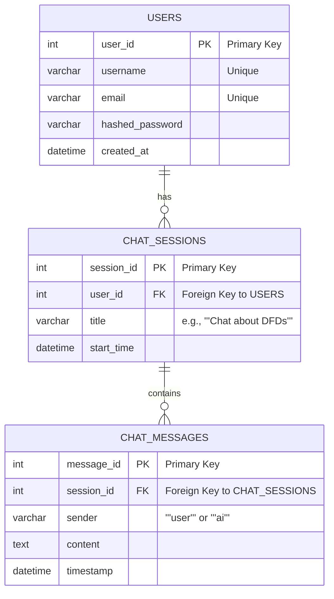

# ERD (Entity-Relationship Diagram)

Diagram ini memodelkan struktur entitas dan relasi untuk database aplikasi. Ini didasarkan pada skema yang ada di `app/schemas/`.

> **Catatan**: Data yang di-ingest dan disimpan di Azure AI Search tidak digambarkan di sini karena merupakan *data store* semi-terstruktur/dokumen, bukan bagian dari database relasional utama.

> **Penjelasan Entitas:**
> -   **USERS**: Menyimpan informasi kredensial dan data pengguna. Setiap pengguna unik.
> -   **CHAT_SESSIONS**: Mewakili satu sesi percakapan yang dimiliki oleh seorang pengguna. Ini memungkinkan pengelompokan pesan.
> -   **CHAT_MESSAGES**: Menyimpan setiap pesan individual dalam sebuah sesi, lengkap dengan pengirimnya (user atau AI) dan isinya.
>
> **Relasi:**
> -   Seorang `USER` dapat memiliki banyak (`o{`) `CHAT_SESSIONS`.
> -   Satu `CHAT_SESSION` dapat berisi banyak (`o{`) `CHAT_MESSAGES`.
