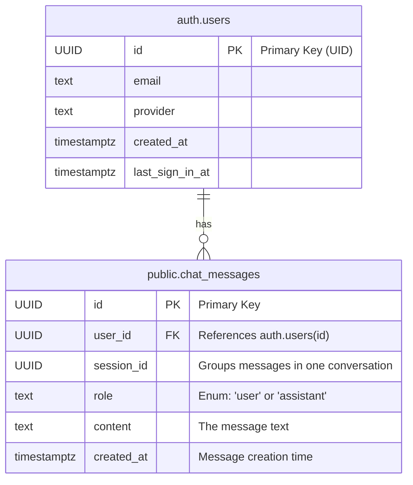

# Entity-Relationship Diagram (ERD)

Dokumen ini menggambarkan struktur database yang ada saat ini, yang dikelola oleh Supabase. Desain ini berpusat pada satu tabel utama, `public.chat_messages`, untuk menyimpan semua riwayat percakapan dan menautkannya langsung ke pengguna yang terautentikasi.

## Diagram ERD

## Deskripsi Entitas dan Hubungan

### Tabel: `auth.users` (Disediakan oleh Supabase)
Ini adalah tabel inti dari layanan Supabase Authentication yang menyimpan data pengguna.

| Nama Kolom | Tipe Data | Deskripsi |
| :--- | :--- | :--- |
| `id` | `UUID` | Kunci utama (Primary Key) unik untuk setiap pengguna (UID). |
| `email` | `TEXT` | Alamat email pengguna. |
| `provider` | `TEXT` | Metode login yang digunakan (misalnya, 'email', 'google'). |
| `created_at` | `TIMESTAMPTZ` | Waktu saat akun pengguna dibuat. |
| `last_sign_in_at`| `TIMESTAMPTZ` | Waktu saat pengguna terakhir kali login. |

### Tabel: `public.chat_messages`
Tabel ini menyimpan setiap pesan individual dari semua percakapan.

| Nama Kolom | Tipe Data | Deskripsi | Kendala (Constraints) |
| :--- | :--- | :--- | :--- |
| `id` | `UUID` | Kunci utama (Primary Key) unik untuk setiap pesan. | `PRIMARY KEY` |
| `user_id` | `UUID` | Kunci asing (Foreign Key) yang merujuk ke `auth.users.id`. | `FOREIGN KEY` |
| `session_id` | `UUID` | Pengidentifikasi untuk mengelompokkan pesan dalam satu sesi percakapan. | `NOT NULL` |
| `role` | `TEXT` | Menandakan pengirim pesan, yaitu `'user'` atau `'assistant'`. | `NOT NULL` |
| `content` | `TEXT` | Isi teks dari pesan. | `NOT NULL` |
| `created_at` | `TIMESTAMPTZ`| Waktu saat pesan dibuat. | `DEFAULT now()` |

### Hubungan dan Logika

*   **Hubungan Satu-ke-Banyak:** Satu pengguna (`auth.users`) dapat memiliki banyak pesan (`chat_messages`). Hubungan ini diimplementasikan melalui kolom `chat_messages.user_id`.
*   **Pengelompokan Sesi:** Pesan-pesan yang termasuk dalam satu percakapan yang sama diidentifikasi dengan memiliki nilai `session_id` yang sama.
*   **Analisis Durasi Sesi:** Dalam desain ini, durasi sebuah sesi tidak disimpan secara langsung. Untuk menghitungnya, perlu dilakukan query agregat pada tabel `chat_messages` untuk `session_id` tertentu, yaitu dengan menghitung selisih antara `MAX(created_at)` dan `MIN(created_at)`.
