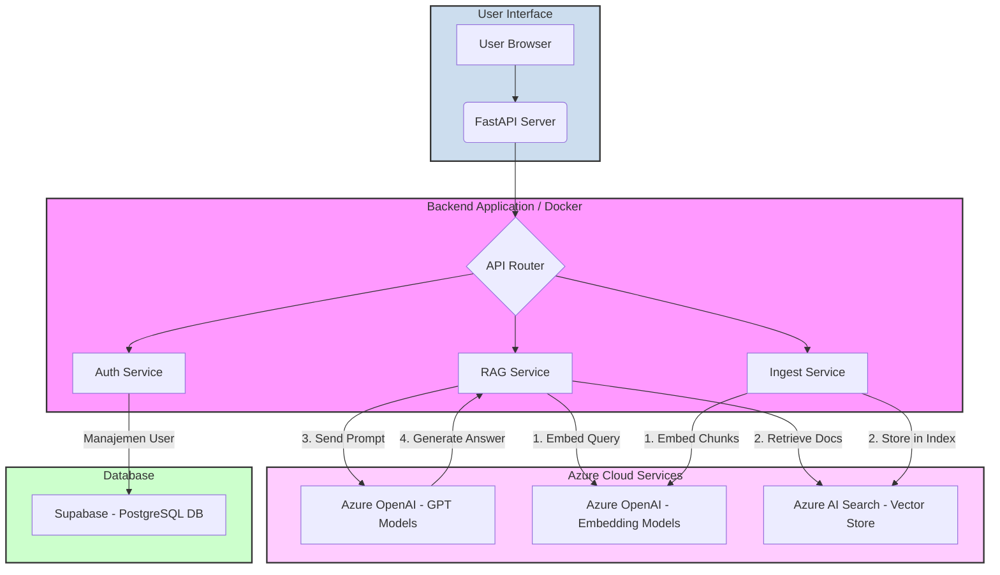

# Diagram Arsitektur Aplikasi

Berikut adalah diagram arsitektur yang menggambarkan komponen utama dari sistem chatbot AI ini, serta teknologi yang digunakan untuk setiap komponen. Versi ini telah diperbaiki untuk memastikan kompatibilitas sintaks dengan renderer Mermaid.



### Cara Menggunakan

1.  **PENTING:** Salin **hanya kode Mermaid** di dalam blok di atas. Jangan sertakan baris ` ```mermaid ` atau ` ``` `.
2.  Tempelkan kode yang telah disalin ke editor yang mendukung Mermaid (seperti [Mermaid Live Editor](https://mermaid.live)).
3.  Diagram arsitektur akan secara otomatis digambar.

---

### Deskripsi Komponen dan Teknologi

1.  **User Interface**:
    *   **Teknologi**: Browser Web standar.
    *   **Deskripsi**: Titik masuk bagi pengguna untuk berinteraksi dengan aplikasi. Mengirim permintaan HTTP ke backend.

2.  **Backend Application (FastAPI on Docker)**:
    *   **Teknologi**: **FastAPI**, **Docker**.
    *   **Deskripsi**: Inti dari aplikasi yang berjalan di dalam kontainer Docker. FastAPI berfungsi sebagai server API yang menerima permintaan dan mengarahkannya ke layanan yang sesuai.
    *   **Auth Service**: Mengelola logika untuk registrasi dan login pengguna. Berkomunikasi dengan database Supabase.
    *   **RAG Service**: Mengelola alur *Retrieval-Augmented Generation*. Ini mengorkestrasi interaksi antara model embedding, vector store, dan model LLM untuk menghasilkan jawaban.
    *   **Ingest Service**: Menangani proses memasukkan dokumen baru ke dalam sistem, termasuk memecah dokumen, membuat embedding, dan menyimpannya di Azure AI Search.

3.  **Azure Cloud Services**:
    *   **Teknologi**: **Azure OpenAI**, **Azure AI Search**.
    *   **Deskripsi**: Kumpulan layanan terkelola dari Microsoft Azure yang menyediakan kemampuan AI.
    *   **Azure OpenAI Models**: Menyediakan akses ke model bahasa (GPT) untuk pembuatan jawaban dan model embedding untuk mengubah teks menjadi vektor.
    *   **Azure AI Search**: Berfungsi sebagai *vector store* yang kuat, menyimpan embedding dokumen dan memungkinkan pencarian relevansi yang cepat.

4.  **Database**:
    *   **Teknologi**: **Supabase** (menggunakan **PostgreSQL**).
    *   **Deskripsi**: Digunakan sebagai database relasional untuk menyimpan data pengguna, seperti informasi login dan profil.