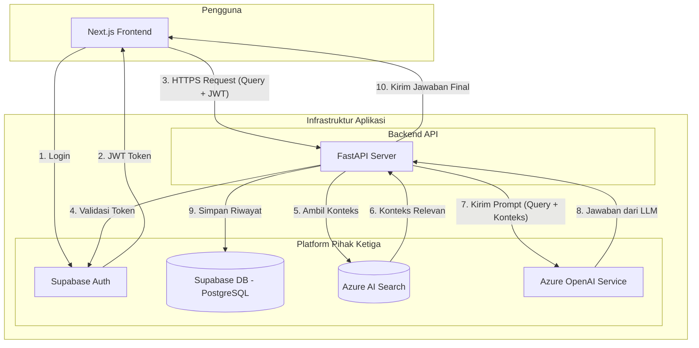

# Arsitektur Sistem Chatbot AI

Dokumen ini menjelaskan arsitektur teknis dari sistem Chatbot AI. Arsitektur ini dibangun di atas tumpukan teknologi modern yang spesifik, dirancang untuk modularitas dan skalabilitas, dengan memanfaatkan layanan cloud terkelola untuk membangun aplikasi berbasis *Retrieval-Augmented Generation* (RAG) yang andal.

## Komponen Teknologi Inti

Sistem ini terdiri dari lima komponen utama yang saling terintegrasi:

1.  **Frontend (Aplikasi Klien):**
    *   **Teknologi:** **Next.js** (framework React).
    *   **Fungsi:** Menyediakan antarmuka pengguna (UI) yang interaktif bagi pengguna. Bertanggung jawab untuk menampilkan percakapan, mengelola status sesi (`session_id`), dan berinteraksi dengan **Supabase Auth** untuk mendapatkan token JWT pengguna.

2.  **Backend (API Server):**
    *   **Teknologi:** **FastAPI** (framework Python).
    *   **Fungsi:** Bertindak sebagai pusat logika aplikasi. Menyediakan REST API yang aman untuk menangani permintaan dari frontend, memvalidasi token JWT, dan mengorkestrasi interaksi antara layanan AI dan database.

3.  **Platform Data & Autentikasi:**
    *   **Teknologi:** **Supabase**.
    *   **Fungsi:** Menyediakan dua layanan krusial:
        *   **Database (PostgreSQL):** Menyimpan data terstruktur, khususnya tabel `chat_messages` untuk riwayat percakapan.
        *   **Auth:** Mengelola seluruh siklus hidup autentikasi pengguna, termasuk pendaftaran, login, dan penerbitan token JWT.

4.  **Layanan AI untuk Penalaran (Generation):**
    *   **Teknologi:** **Azure OpenAI Service**.
    *   **Fungsi:** Menyediakan akses ke model bahasa skala besar (LLM) seperti GPT-4. Digunakan untuk memahami prompt gabungan (query + konteks) dan menghasilkan jawaban yang relevan dan koheren.

5.  **Layanan AI untuk Pengetahuan (Retrieval):**
    *   **Teknologi:** **Azure AI Search**.
    *   **Fungsi:** Berperan sebagai basis pengetahuan (knowledge base) sistem. Mengindeks data dan vektor dari dokumen sumber, dan menyediakan kemampuan pencarian hibrida (vektor + teks) untuk menemukan konteks yang paling relevan dengan query pengguna.

## Diagram Arsitektur Sistem

Diagram berikut mengilustrasikan bagaimana komponen-komponen di atas saling terhubung dalam satu alur kerja yang kohesif.

## Alur Kerja Sistem

### 1. Alur Ingest Data (Offline)

Alur ini bertujuan untuk memasukkan pengetahuan dari dokumen ke dalam **Azure AI Search**.

1.  **Input:** Admin menyediakan dokumen sumber (PDF, DOCX, dll.).
2.  **Pemrosesan (ETL dengan LangChain):** Sebuah skrip (`temp_ingest.py` atau notebook) yang menggunakan **LangChain** melakukan:
    *   **Ekstraksi & Pemecahan (Chunking):** Membaca dokumen dan memecahnya menjadi potongan-potongan teks yang lebih kecil.
    *   **Embedding:** Menggunakan model embedding dari **Azure OpenAI** untuk mengubah setiap potongan teks menjadi vektor numerik.
3.  **Pemuatan (Load):** Skrip tersebut mengunggah potongan teks beserta vektornya ke dalam indeks di **Azure AI Search**, membuatnya siap untuk pencarian.

### 2. Alur Chat RAG (Real-time)

Alur ini terjadi saat pengguna berinteraksi dengan chatbot.

1.  **Otentikasi:** Pengguna login melalui antarmuka **Next.js**. Next.js berkomunikasi dengan **Supabase Auth** untuk memverifikasi pengguna dan menerima token JWT.
2.  **Permintaan (Request):** Pengguna mengirimkan pertanyaan. Frontend **Next.js** membuat permintaan HTTPS ke **FastAPI**, menyertakan pertanyaan, `session_id`, dan token JWT di header `Authorization`.
3.  **Validasi & Pengambilan Konteks (Retrieval):**
    *   **FastAPI** menerima permintaan dan memvalidasi token JWT dengan **Supabase Auth** untuk mengidentifikasi pengguna.
    *   Layanan chat di FastAPI mengirimkan query pengguna ke **Azure AI Search** untuk mengambil potongan-potongan dokumen yang paling relevan (konteks).
4.  **Penambahan & Penalaran (Augmentation & Generation):**
    *   **FastAPI** menggabungkan query asli dengan konteks yang diterima dari Azure AI Search untuk membuat sebuah *prompt* yang kaya informasi.
    *   Prompt ini dikirim ke model LLM di **Azure OpenAI Service**.
5.  **Respons & Pencatatan:**
    *   **Azure OpenAI** menghasilkan jawaban dan mengirimkannya kembali ke **FastAPI**.
    *   **FastAPI** menyimpan pesan pertanyaan dan jawaban ke dalam tabel `chat_messages` di **Supabase DB**, menautkannya dengan `user_id` dan `session_id`.
    *   **FastAPI** mengirimkan jawaban final beserta sumbernya kembali ke frontend **Next.js** untuk ditampilkan kepada pengguna.
