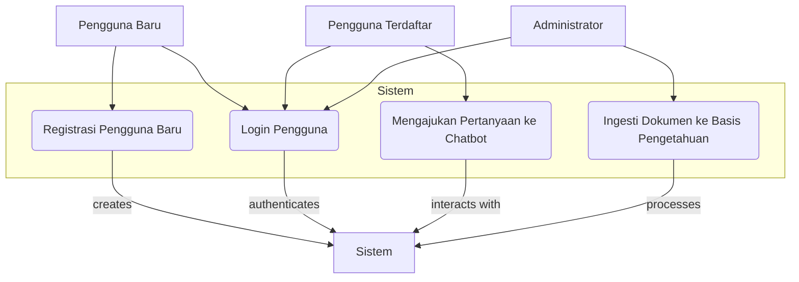

```mermaid
%% Diagram Use Case Aplikasi Chatbot AI
graph TD
    A[Pengguna Baru] --> UC1(Registrasi Pengguna Baru)
    A --> UC2(Login Pengguna)

    B[Pengguna Terdaftar] --> UC2
    B --> UC3(Mengajukan Pertanyaan ke Chatbot)

    C[Administrator] --> UC2
    C --> UC4(Ingesti Dokumen ke Basis Pengetahuan)

    UC1 -- creates --> D[Sistem]
    UC2 -- authenticates --> D
    UC3 -- interacts with --> D
    UC4 -- processes --> D

    subgraph Sistem
        UC1
        UC2
        UC3
        UC4
    end
```